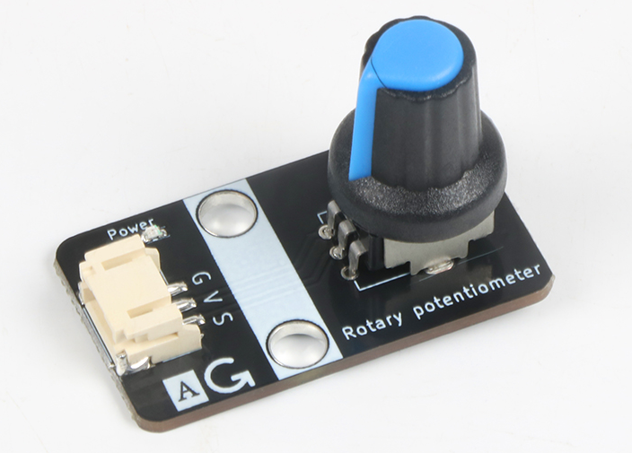
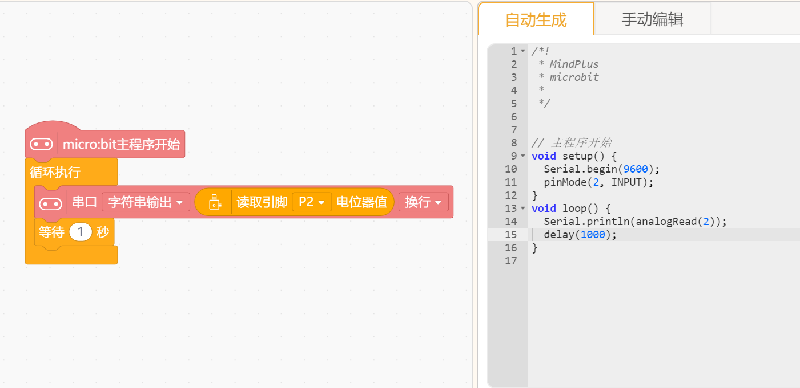
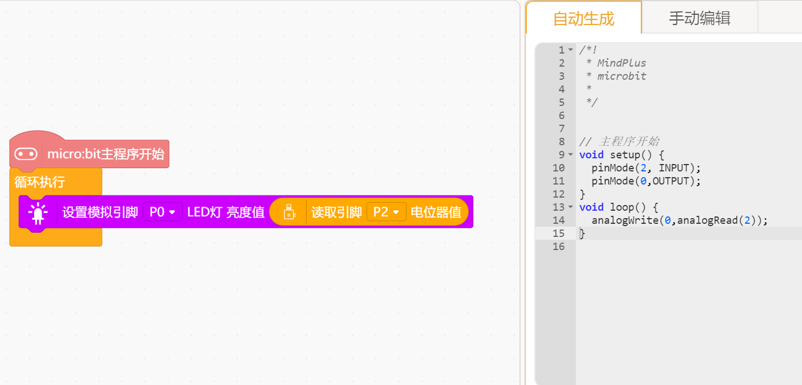

# 电位器

## 介绍
Mars:Lab          巡线传感器测试

用于识别地面地面颜色灰度的传感器

## 编程软件
使用mind+ 进行编程

## 积木列表

## 示例程序

## 挑战任务

## 许可证

MIT

## 支持模式

micro:bit 上传模式

## 更新日志
* V0.0.1  基础功能完成

## 参与贡献

1.  MarsCollege 创建图形库，提交ArduinoC代码

## 关于我们

[思铺学院](http://www.worldshaper.cn/).
[火星学院](http://www.marscollege.cn/).